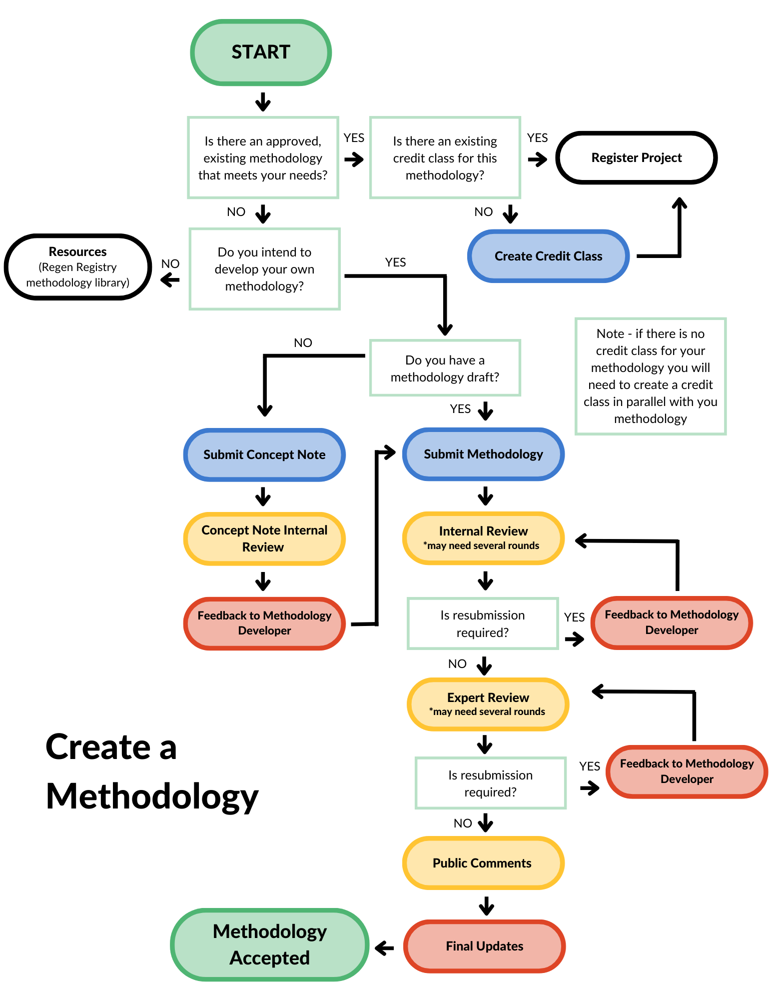

# Methodology Development Overview

The Regen Registry Guide outlines the varied ways that creating credits, data tracking and sharing can be achieved. In general, the more a methodology transparently adheres to processes of tracking, measuring and validating data, the higher the integrity and economic value as agreed upon by the community.

The methodology details the monitoring, reporting and verification (MRV) process that is specific to a set of users.  We use the [credit class](../credit-classes/credit-class-overview.md) to define credit type, credit unit, project activities and ecosystem types.

Many times there will be a one to one pairing of the methodology and credit class but we would like to leave open the option for a credit class to house several methodologies that are similar but may have been adapted slightly to different areas/projects.

As a methodology is being developed, Regen Registry and Regen Science Team are available for informal feedback and facilitating connections with expertise and knowledge outside of RND.  See the [Methodology Development Support](methodology-development-support.md) chapter for more details.

**Methodology Development Process:**&#x20;

The development of a methodology should include:&#x20;

Research into existing approved methodologies in the [Regen Registry Methodology Library](http://localhost:5000/o/HLlZLPGRtuSIEfuq1a8I/s/H1QmzemVpWDCJv0QlPOj/) and those listed on other registries that may be similar, are tested and can be used as models for your methodology.&#x20;

If using a methodology from an outside registry, it is the methodology developers responsibility to contact the author of the methodology to ask for permission to use that methodology. Cited resources and/or first hand interviews and accounts of regenerative work and observed successes from knowledgeable and experienced Earth stewards in the projects specified ecosystem outline of researched monitoring approach including monitoring protocols and frequency description of verification process.

<figure><figcaption></figcaption></figure>
